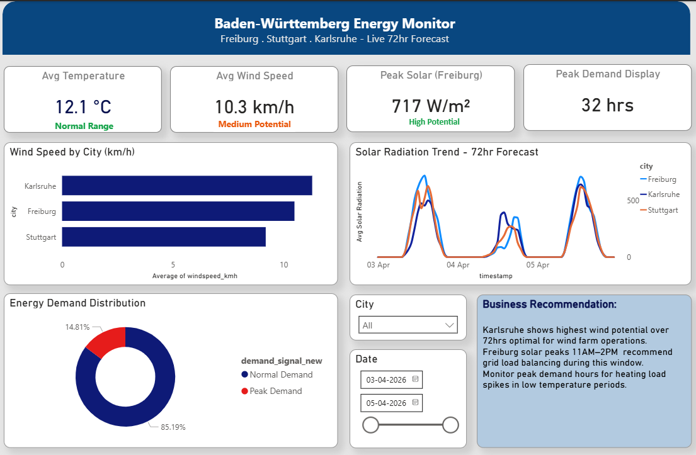

# 🔋 Baden-Württemberg Energy Monitor



A real-time energy monitoring dashboard for three major cities in Baden-Württemberg, Germany — built with Python, PostgreSQL, and Power BI.

---

## 📌 Project Overview

This project simulates a real-world energy analytics pipeline used by utility companies to monitor renewable energy potential and grid demand. It fetches live weather and energy data, processes it through a Python pipeline, stores it in PostgreSQL, and visualizes it in an interactive Power BI dashboard.

---

## 🏙️ Cities Covered
- 🌞 **Freiburg** — Germany's sunniest city, highest solar potential
- 🏭 **Stuttgart** — Major industrial hub, home to Bosch & Mercedes
- ⚡ **Karlsruhe** — Tech & engineering city, highest wind potential

---

## 🛠️ Tech Stack

| Tool | Purpose |
|---|---|
| Python | Data fetching, cleaning, pipeline automation |
| Pandas | Data transformation and business logic |
| Open-Meteo API | Live weather & solar/wind data (free, no key needed) |
| PostgreSQL | Local data storage and SQL querying |
| SQLAlchemy | Python to PostgreSQL connection |
| Power BI | Interactive dashboard and visualization |

---

## 📊 Dashboard Features

- **4 KPI Cards** — Avg Temperature, Avg Wind Speed, Peak Solar Radiation, Peak Demand Hours
- **Bar Chart** — Average wind speed by city
- **Line Chart** — Solar radiation trend across 72hr forecast
- **Donut Chart** — Energy demand distribution (Normal vs Peak)
- **Interactive Slicers** — Filter by City and Date
- **Business Recommendation Panel** — Actionable insights for grid operators

---

## ⚙️ How It Works

Live API (Open-Meteo)
↓
Python Pipeline
(fetch → clean → enrich)
↓
PostgreSQL Database
(energy_data table)
↓
CSV Export
↓
Power BI Dashboard
(real-time visuals + recommendations)

---

## 📈 Dataset Summary

| Metric | Value |
|---|---|
| Total Rows | 216 |
| Cities | Freiburg, Stuttgart, Karlsruhe |
| Date Range | 2026-04-03 to 2026-04-05 |
| Forecast Window | 72 hours (hourly data) |
| Data Source | Open-Meteo API |

---

## 💡 Business Intelligence Added

- **Wind Potential Classification** — Low / Medium / High / Very High based on wind speed thresholds
- **Solar Potential Classification** — Low / Medium / High / Very High based on radiation levels
- **Energy Demand Signal** — Peak Demand flagged when temperature drops below 8°C or rises above 18°C
- **Time Features** — Hour, Date, Day Name extracted for Power BI time-based filtering

---

## 🔍 Key Insights

- **Karlsruhe** recorded the highest average wind speed — optimal window for wind farm operations
- **Freiburg** showed peak solar radiation of **717 W/m²** — highest among all three cities
- Solar output peaks between **11AM–2PM** daily — grid load balancing recommended during this window
- **85.19%** of hours fall under Normal Demand — **14.81%** flagged as Peak Demand periods

---

## 🚀 How to Run

1. Clone this repository
```bash
git clone https://github.com/abhirajgm1924-sys/energy-dashboard-germany.git
```

2. Install dependencies
```bash
pip install requests pandas sqlalchemy psycopg2-binary
```

3. Set up PostgreSQL and create database `energy_dashboard`

4. Run the notebook
```bash
jupyter notebook scripts/energy_pipeline.ipynb
```

5. Open `dashboard/energy_dashboard.pbix` in Power BI Desktop

---

## 👤 Author

**Abhiraj** — Data Analyst | Hochschule Offenburg
- GitHub: [@abhirajgm1924-sys](https://github.com/abhirajgm1924-sys)

---

## 📬 Contact

Open to Data Analyst / Data Scientist roles in Germany.
Feel free to connect on [LinkedIn](www.linkedin.com/in/abhiraj-pittala-79b1551b2) or reach out via GitHub!
